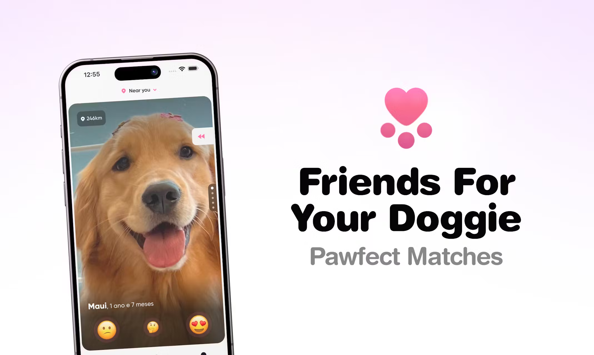

<div align="center">

<br>
</div>

# Pegada - Dog Dating App

[](https://github.com/GSTJ)
[](https://github.com/GSTJ/pegada/stargazers)
[](https://github.com/GSTJ/pegada/network/members)
[](https://www.producthunt.com/posts/pegada)
[](https://apps.apple.com/br/app/pegada/id6450865592)
[](https://play.google.com/store/apps/details?id=app.pegada)

> **Find the perfect companion for your furry friend!**

<div align="center">

</div>

<br />

Pegada is the ultimate social app for dogs. It's not just Tinder for dogs - it's a platform designed for socializing our furry friends. Here, users aren't humans, but dogs! Your pet's profile will be the one making connections.

## ✨ Features

- **Match Algorithm** - Find perfect playdates for your dog based on breed, location, and personality
- **Profile Creation** - Create detailed profiles for your pets
- **Inclusive Platform** - All paws are welcome - pedigree or mixed breed
- **Safe Messaging** - Connect with other pet owners in a secure environment
- **Multilingual** - Available in English and Portuguese

## 🚀 Getting Started

### Prerequisites

- [Node.js](https://nodejs.org/) (see .nvmrc for version)
- [pnpm](https://pnpm.io/) v9.6.0+
- [Docker](https://www.docker.com/)

### Installation

1. **Clone the repository**

   ```sh
   git clone https://github.com/GSTJ/pegada.git
   cd pegada
   ```

2. **Install dependencies**

   ```sh
   pnpm install
   ```

3. **Start developing**

   ```sh
   # Run the entire stack
   pnpm start:everything

   # Or run specific parts
   pnpm nextjs dev    # Web app
   pnpm mobile start  # Mobile app
   pnpm queue dev     # Backend services
   ```
